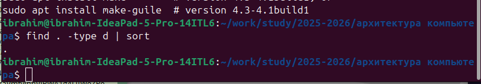
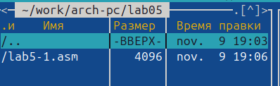
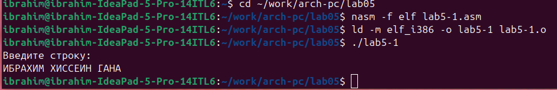
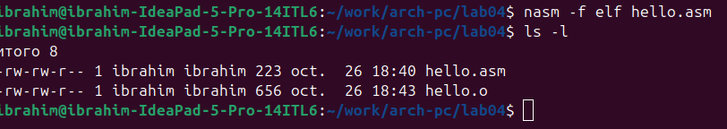
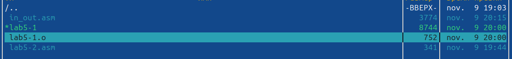
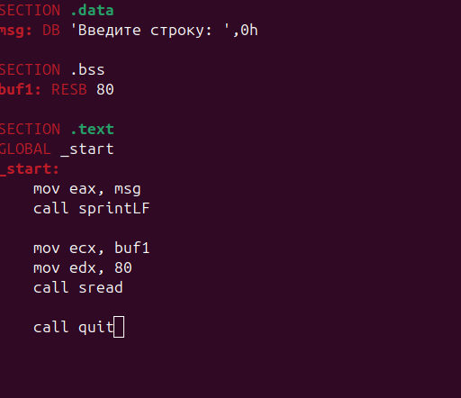
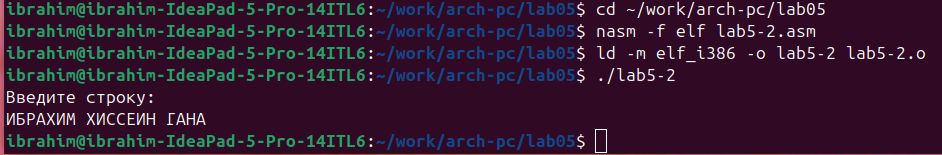
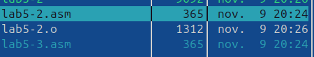
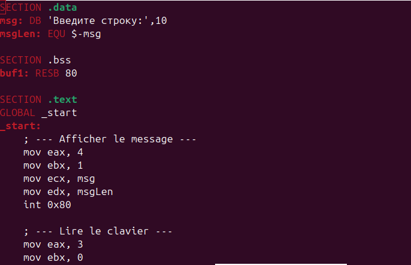
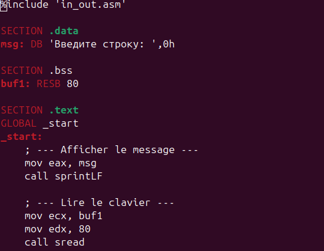

# Лабораторная работа №5
# Основы работы с Midnight Commander. Структура программы на языке ассемблера NASM. Системные вызовы в ОС GNU Linux

## Цель работы
Приобретение практических навыков работы в Midnight Commander. Освоение инструкций языка ассемблера mov и int.
## Выполнение лабораторной работы

### 1. Работа с Midnight Commander

#### 1.1. Создание каталога lab05
- Открыли Midnight Commander с помощью команды `mc`
- Перешли в каталог `~/work/arch-pc`
- Создали каталог `lab05` с помощью клавиши F7


#### 1.2. Создание файлов программ
- Создали файл `lab5-1.asm` с помощью F4

### 2. Программа lab5-1.asm (без внешних файлов)

#### 2.1. Код программы
```nasm
SECTION .data
msg: DB 'Введите строку:',10
msgLen: EQU $-msg

SECTION .bss
buf1: RESB 80

SECTION .text
GLOBAL _start
_start:
    mov eax, 4
    mov ebx, 1
    mov ecx, msg
    mov edx, msgLen
    int 0x80

    mov eax, 3
    mov ebx, 0
    mov ecx, buf1
    mov edx, 80
    int 0x80

    mov eax, 1
    mov ebx, 0
    int 0x80

#### 2.2. Компиляция и выполнение
```bash
nasm -f elf lab5-1.asm
ld -m elf_i386 -o lab5-1 lab5-1.o
./lab5-1
Результат
Введите строку:
ИБРАХИМ ХИССЕИН ГАНА

### 3. Программа lab5-2.asm (с файлом in_out.asm)

#### 3.1. Копирование файла in_out.asm
- Скопировали файл `in_out.asm` в каталог lab05



#### 3.2. Создание lab5-2.asm
- Создали копию файла lab5-1.asm с именем lab5-2.asm


#### 3.3. Код программы lab5-2.asm
```nasm
%include 'in_out.asm'

SECTION .data
msg: DB 'Введите строку: ',0h

SECTION .bss
buf1: RESB 80

SECTION .text
GLOBAL _start
_start:
    mov eax, msg
    call sprintLF

    mov ecx, buf1
    mov edx, 80
    call sread

    call quit

#### 3.4. Компиляция и выполнение
```bash
nasm -f elf lab5-2.asm
ld -m elf_i386 -o lab5-2 lab5-2.o
./lab5-2
Результат:
Введите строку: 
ИБРАХИМ ХИССЕИН ГАНА

## Самостоятельная работа

### 1. Программа lab5-3.asm (без in_out.asm)

#### 1.1. Создание файла
- Создали копию lab5-1.asm с именем lab5-3.asm


#### 1.2. Модифицированный код
```nasm
SECTION .data
msg: DB 'Введите строку:',10
msgLen: EQU $-msg

SECTION .bss
buf1: RESB 80

SECTION .text
GLOBAL _start
_start:
    mov eax, 4
    mov ebx, 1
    mov ecx, msg
    mov edx, msgLen
    int 0x80

    mov eax, 3
    mov ebx, 0
    mov ecx, buf1
    mov edx, 80
    int 0x80

    mov eax, 4
    mov ebx, 1
    mov ecx, buf1
    mov edx, 80
    int 0x80

    mov eax, 1
    mov ebx, 0
    int 0x80

#### 1.3. Результат выполнения
```bash
nasm -f elf lab5-3.asm
ld -m elf_i386 -o lab5-3 lab5-3.o
./lab5-3
Введите строку:
ИБРАХИМ ХИССЕИН ГАНА
ИБРАХИМ ХИССЕИН ГАНА


### 2. Программа lab5-4.asm (с in_out.asm)

#### 2.1. Создание файла
- Создали копию lab5-2.asm с именем lab5-4.asm



#### 2.2. Модифицированный код
```nasm
%include 'in_out.asm'

SECTION .data
msg: DB 'Введите строку: ',0h

SECTION .bss
buf1: RESB 80

SECTION .text
GLOBAL _start
_start:
    mov eax, msg
    call sprintLF

    mov ecx, buf1
    mov edx, 80
    call sread

    mov eax, buf1
    call sprintLF

    call quit

2.3. Результат выполнения
nasm -f elf lab5-4.asm
ld -m elf_i386 -o lab5-4 lab5-4.o
./lab5-4
Результат:
Введите строку: 
ИБРАХИМ ХИССЕИН ГАНА
ИБРАХИМ ХИССЕИН ГАНА

**Ensuite :**
1. **F2** pour sauvegarder
2. **F10** pour quitter

**Dites-moi quand c'est fait pour ajouter les conclusions !** 🚀
## Выводы

В ходе лабораторной работы:
- Освоили работу с файловым менеджером Midnight Commander
- Изучили структуру программ на языке ассемблера NASM
- Освоили использование инструкций mov и int
- Научились использовать системные вызовы для ввода/вывода данных
- Освоили подключение внешних файлов с подпрограммами
- Написали 4 программы, реализующие ввод и вывод данных

Работа выполнена успешно, все программы работают корректно.
